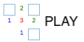

# minesnf - cooperative non-flagging minesweeper (with a twist)

## what is this all about?
This stuff is a love letter to the original minesweeper game some of us used to play long time ago (and still continues to play) and some others are yet to discover

But this is also my manifest against pay-2-win games that treat players with a drug dealer's attitude. And by that I mean this stuff is not going to provide you with some little fun for free and demand insane amount of money to continue getting fun later. It is going to be free as beer and provide player with game mechanics that would challenge and reward him for being skillful.

Basically, *non-flagging* means you can not put flags to mark possible mines and instead can just left click/tap to open cells with no mines (if you are lucky) and  *cooperative* obviously means it is somehow can be played along with somebody else )

#### ***Latest release: 1.3 (mid2019)***

#### Classic flavour
Just non-flagging game with an option to play the same board with somebody in a real time
- solo, coop, versus modes for online mode
    -  solo - pure zen of non-flagging game
    -  cooperative - open the same board together, bomb resets the board
    -  versus - open the same board together, win if you scored more points opening cells, bomb freezes you and gives -8 points
- fastest possible experience with offline solo mode

#### RPG flavour (what a twist)
Introduces roguelike mechanics: mine -> fight -> craft -> repeat

Descend the floors by solving the boards and fighting the bosses. Claim the loot (digits from boards) by ascending back to use it in crafting.

- solo or cooperative experience
- endless mine floors to descend and gain loot upon ascending
- increasing difficulty of mobs on floors
- fight or flee or try to steal battle
- action points based asynchronous battle mechanics
- control the fight with buffs/debuffs
- tank with "defend" and combo with "assist" in multiplayer
- four crafting recipes to uncover from wise bosses
- common, rare, and epic gems to become stronger and change the battle outcome in your favour

Both Classic and RPG flavours are supported in online and offline mode.
But for those who can play sub100 ping can severely affect playability.

For an ios/android app there is also a full offline mode supported, which means you can play while commutting through the underground or other places where network is unreachable.

There is our [youtube channel](https://www.youtube.com/channel/UCEvqfPKGtfqfyeMCnw7B_zA) that describe some general or release-specific stuff

### ok, so what's the status?

Well, the thing didn't lift off, so as of 2020 no further development is planned and most of the servers are turned off.

The discord server is still up, but most probably empty.

In case you have somehow found this page and want to reach out to me, please find me on [twitter](https://twitter.com/myakinkii)

## can I still play this stuff?

1. You can play web version directly by clicking [global.minesnf.com](http://global.minesnf.com) link or picking the server link below from the list of servers

2. Or download the stable release from [Google play](https://play.google.com/store/apps/details?id=com.minesnf.openui5) or [App Store](https://itunes.apple.com/app/id1448244535)

### list of (previously) available servers
* [eu1.minesnf.com](http://eu1.minesnf.com) (Amsterdam, NL) -> turned off
* [tor1.minesnf.com](http://tor1.minesnf.com) (Toronto, CA) -> turned off
* [blr1.minesnf.com](http://blr1.minesnf.com) (Bangalore, IN) -> turned off
* [ru1.minesnf.com](http://ru1.minesnf.com) (Moscow, RU) -> global

### and what if I still want to play multiplayer games with low latency and some friends? ###
You can setup your own server and connect your mobile app to it. Here's an article about how to [run the local server](https://github.com/myakinkii/minesNF/wiki/Run-own-backend).

## can I use the code?
Yes, you can. 

The code is available under the MIT license at github.

Check out the github repos for [nodejs backend](https://github.com/myakinkii/minesNF) and [openui5 based client](https://github.com/myakinkii/ui5client)

It is worth mentioning though, that the code quality is pretty low for any productive usage.

